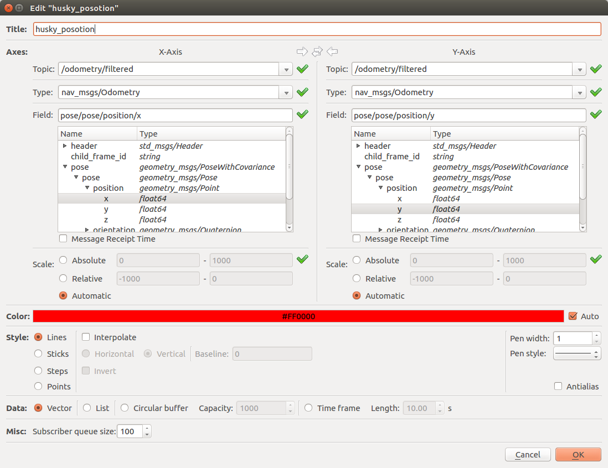

# Exercise Section 4

- Copy the launch file from Exercise 2. Rename and remove the `husky_hl_ctrl` node.
  Launch and check `/ekf_localization`.  
  ```sh
  roslaunch husky.launch
  # in a new console
  rosnode info /ekf_localization
  rosrun rqt_graph rqt_graph
  ```
- [`rqt_multiplot`](https://github.com/ANYbotics/rqt_multiplot_plugin)  
  ```sh
  # install if needed
  sudo apt-get install ros-kinetic-rqt-multiplot
  ```
  ```sh
  rosrun rqt_multiplot rqt_multiplot
  ```
  Configure the plugin as following ([ref](https://youtu.be/feXC7aQrkeM?t=1881)):
    
  Then navigate husky and see the change on `rqt_multiplot`
- Download `husky_navigation.bag` and check with `rosbag info`  
- Create a new `ekf_localization.launch` file (refer to `$(find husky_control)/launch/control.launch`)
  - load husky model
  - add `ekf_localization_node`
  - add `robot_state_publisher` node
  - add `rqt_multiplot`
  - add `rviz`
  - launch and plot rosbag information
    ```sh
    roslaunch ekf_localization.launch
    # in a new console
    rosbag play [.bag] --clock
    ```
  - Configure `RViz` to visualize LiDAR data
